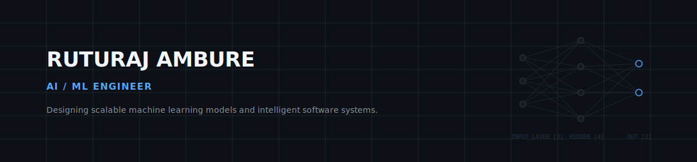

---

### Introduction

B.Tech undergraduate in Artificial Intelligence and Data Science at Vishwakarma Institute of Technology, Pune (CGPA: 8.67/10). Focus lies in developing production-grade machine learning models, neural network architectures, and secure software solutions. Experienced in developing full-stack web products and coordinating industry-sponsored engineering projects.

---

### Key Capabilities

* **Systems Architecture**: Experienced in designing modular microservices, structured database schemas, and robust API endpoints.
* **Applied Machine Learning**: Practical implementation of computer vision pipelines, including U-Net semantic segmentation, ResNet50 classification, and PaddleOCR document analysis.
* **Security & Cryptography**: Implementation of secure systems incorporating steganography algorithms and standard encryption protocols (AES-256).
* **Core CS Foundations**: Strong analytical foundations in Data Structures & Algorithms, Object-Oriented Programming (OOP), and Database Management Systems (DBMS).

---

### Sponsored Engineering Experience

#### **Indian Railways (Nagpur Division)**  
*Project Developer — Sponsored Project* | *April 2026 – June 2026*
* Architected and developed a centralized operational inspection and evaluation system to monitor operational metrics across multiple railway stations.
* Designed role-based workflows, safety counseling tracking, and performance audit dashboards.
* Engineered a scalable database structure and automated safety compliance report generation.

#### **Cravita Technologies India Pvt. Ltd.**  
*Project Developer — Sponsored Project* | *August 2025 – November 2025*
* Developed a secure incident tracker featuring automated incident tracking, resolution workflows, and SMTP-based notification mechanisms.
* Integrated Generative AI LLM APIs to analyze incident logs and generate automated resolution insights.
* Enhanced operational visibility and reduced resolution turnaround times.

---

### Featured Projects

#### **TumorVerse — Virtual Cancer Simulation Using AI**
* **Problem**: Manual cell structure and region delineation in digital pathology imaging is slow and subject to reader variance.
* **Solution**: Developed a unified computer vision framework incorporating U-Net semantic segmentation models for cell boundary detection and ResNet50 structures for image classification.
* **Stack**: Python, PyTorch, XGBoost, U-Net, ResNet50.
* **Impact**: Automated high-precision cancer region classification and boundary delineation.

#### **StegoVault — Secure Data Hiding System**
* **Problem**: Plaintext authentication keys and data payloads are vulnerable to intercept during transmission and cloud storage.
* **Solution**: Engineered a digital steganography application that conceals encrypted secret keys within image pixel matrices using strict Object-Oriented Programming principles.
* **Stack**: Python, React.js, OpenCV, Cryptography.
* **Impact**: Enabled secure transmission of encrypted payloads with zero perceptible image degradation.

#### **KARTA — AI Credit Appraisal Platform**
* **Problem**: Traditional borrower credit verification relies on manual sorting of multilingual documents, slowing down loan processing.
* **Solution**: Architected a credit appraisal service featuring 6 specialized analysis modules combining OCR text extraction (PaddleOCR) and credit risk classification (XGBoost) over 40+ financial indicators.
* **Stack**: FastAPI, React.js, PostgreSQL, PaddleOCR, XGBoost.
* **Impact**: Enabled explainable risk scores and automated parsing of multilingual financial documents.

---

### Technical Skills

| Category | Technologies |
| :--- | :--- |
| **Languages** | C/C++, Python, JavaScript, TypeScript, SQL |
| **AI & Machine Learning** | PyTorch, XGBoost, CNN, U-Net, Deep Learning, Image Processing, PaddleOCR |
| **Backend & Web** | Node.js, Express, FastAPI, RESTful APIs |
| **Frontend** | React.js, HTML5, CSS3, Tailwind CSS |
| **Databases** | PostgreSQL, MySQL |
| **Developer Tools** | Git, GitHub, VS Code, OOP, DBMS, Computer Networks |

---

### Achievements

* **Patents**: Published 2 patents through the Indian Patent Office in the domains of Web Applications and Generative AI-Based Incident Management.
* **AI Bootcamp**: Successfully completed the Advanced Artificial Intelligence Bootcamp conducted by C-DAC Pune under the MeitY & NASSCOM FutureSkills PRIME initiative.
* **DSA Milestones**: Solved 250+ Data Structures & Algorithms problems across LeetCode and Coding Ninjas.

---

### GitHub Analytics & Metrics

  <table border="0" cellpadding="0" cellspacing="0" width="100%">
    <tr>
      <td width="50%" align="center" valign="top">
        
      </td>
      <td width="50%" align="center" valign="top">
        
      </td>
    </tr>
  </table>
  
   
  
  
  
    
  
  <!-- Snake contribution grid -->
  <h4>Interactive Contribution Timeline</h4>
  

---

  <code>ruturajambure@gmail.com</code> • [LinkedIn](https://linkedin.com/in/ruturaj-ambure) • [GitHub](https://github.com/Ruturaj24062006)
    
  
    
  Ruturaj Ambure &bull; 2026

