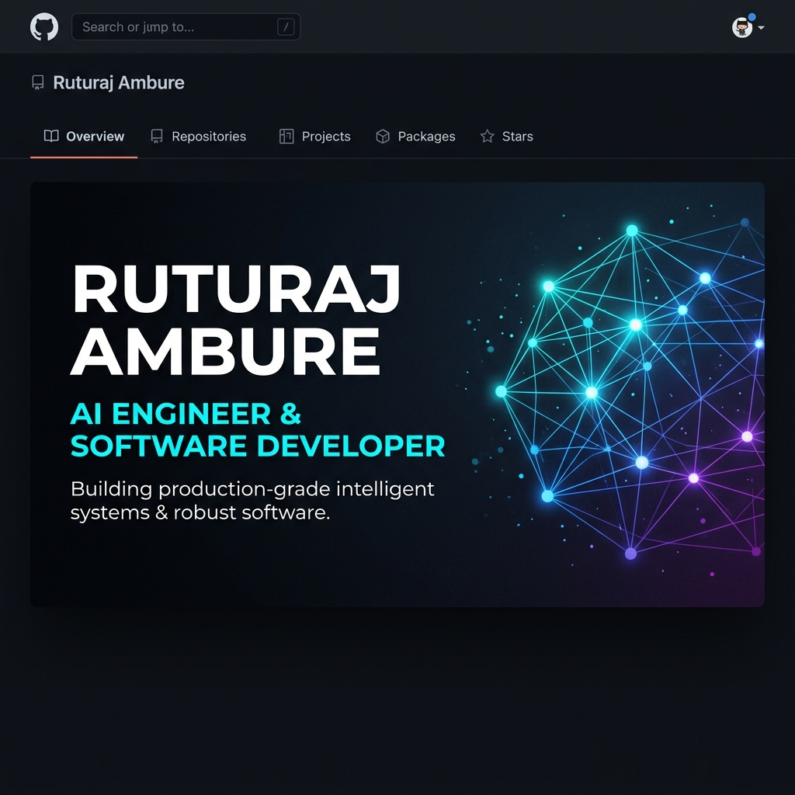

<!-- World-Class Premium GitHub Profile README by Antigravity -->

<div align="center">
  <!-- Hero Banner -->
  
  
  <br /><br />
  
  <!-- Typing Animation -->
  

  <br />

  <p align="center">
    <a href="https://linkedin.com/in/ruturaj-ambure" target="_blank">
      
    </a>
    &nbsp;
    <a href="mailto:ruturajambure@gmail.com" target="_blank">
      
    </a>
    &nbsp;
    <a href="https://github.com/Ruturaj24062006" target="_blank">
      
    </a>
  </p>

  <!-- Visitor Counter -->
  
</div>

<div align="center">
  
</div>

## 🖥️ Developer Console

<details open>
  <summary><b>$ whoami</b></summary>
  <br />
  <blockquote>
    I am an <b>AI &amp; Data Science undergraduate at Vishwakarma Institute of Technology, Pune</b> (CGPA: 8.67/10). My focus is on building secure, production-grade applications, combining applied machine learning research with robust software engineering architecture. I specialize in designing scalable systems, from AI-driven classifiers to highly optimized full-stack web platforms.
  </blockquote>
</details>

<details>
  <summary><b>$ cat credentials.json</b></summary>
  <pre lang="json">
{
  "education": "B.Tech in Artificial Intelligence and Data Science (2024 - 2028)",
  "patents": [
    "Published 2 Patents with the Indian Patent Office (Web Applications &amp; GenAI Incident Management)"
  ],
  "certifications": [
    "C-DAC Pune AI Bootcamp (FutureSkills PRIME - MeitY &amp; NASSCOM initiative)"
  ],
  "problem_solving": "250+ Data Structures &amp; Algorithms challenges solved on LeetCode &amp; Coding Ninjas"
}
  </pre>
</details>

<details>
  <summary><b>$ docker ps --all-deployments</b></summary>
  <pre>
CONTAINER ID   IMAGE                          STATUS          PORTS                  NAMES
e3f28d8b9f0a   railway-evaluation-system:2.0  Up 15 hours     0.0.0.0:8080->80/tcp   railway-dashboard
c4a2b1d3d5f6   secure-incident-tracker:1.1    Up 5 days       0.0.0.0:5000->80/tcp   incident-tracker
d7f1d5c6b7a8   tumor-verse-detection:1.0      Up 3 days       0.0.0.0:8000->80/tcp   cancer-simulation
ef83c6b9d0e2   stegovault-app:1.2             Up 4 hours      0.0.0.0:3000->80/tcp   stegovault-service
  </pre>
</details>

<div align="center">
  
</div>

## 📈 Engineering Milestones & Achievements

<table width="100%">
  <tr>
    <td width="33%" align="center" valign="top">
      <h3>📜 2 Patents</h3>
      <p>Published 2 patents through the <b>Indian Patent Office</b> focusing on <b>Web Applications</b> and <b>Generative AI-Based Incident Management</b> systems.</p>
    </td>
    <td width="33%" align="center" valign="top">
      <h3>🎓 AI Bootcamp</h3>
      <p>Successfully completed training in Advanced AI pipelines conducted by <b>C-DAC Pune</b> under the joint <b>MeitY &amp; NASSCOM</b> FutureSkills PRIME initiative.</p>
    </td>
    <td width="33%" align="center" valign="top">
      <h3>🏆 250+ DSA Solved</h3>
      <p>Solved over <b>250+ Data Structures and Algorithms</b> coding challenges across LeetCode &amp; Coding Ninjas, establishing a strong problem-solving core.</p>
    </td>
  </tr>
</table>

<div align="center">
  
</div>

## 💼 Industry-Sponsored Experience

```
│
├── 🚂 April 2026 – June 2026 ── Indian Railways (Nagpur Division)
│   └── Sponsored Project Developer: Railway Evaluation & Inspection Management System
│       ├── Architected a centralized operational inspection platform to evaluate activities across multiple stations.
│       ├── Designed clean role-based workflows, safety counseling tracking, and performance audit dashboards.
│       └── Engineered a robust database layout with automated report generation to maximize operational transparency.
│
└── 🔒 Aug 2025 – Nov 2025 ── Cravita Technologies India Pvt. Ltd.
    └── Sponsored Project Developer: Secure Incident Tracker using Generative AI
        ├── Built a secure, automated incident reporting and tracking engine with real-time critical email alerts.
        ├── Integrated LLM-based incident classification and analytical summaries using state-of-the-art GenAI models.
        └── Enhanced incident response velocity and system-wide tracking resolution workflows.
```

<div align="center">
  
</div>

## 🚀 Key Software Systems

<table width="100%">
  <tr>
    <td width="50%" valign="top">
      <div align="right">
        
      </div>
      <h4>🧬 TumorVerse - Virtual Cancer Simulation</h4>
      <p><b>Problem:</b> Inefficient workflows for manual cancer region screening in digital pathology images.</p>
      <p><b>Solution:</b> Developed an end-to-end deep learning framework that automates classification using ResNet50 and handles high-precision tumor segmentation via U-Net structures.</p>
      <p>
        
        
        
      </p>
      <a href="https://github.com/Ruturaj24062006/TumorVerse" target="_blank">
        
      </a>
    </td>
    <td width="50%" valign="top">
      <div align="right">
        
      </div>
      <h4>🔒 StegoVault - Secure Data Hiding</h4>
      <p><b>Problem:</b> High vulnerability of raw encrypted keys to interception in modern cloud file storage.</p>
      <p><b>Solution:</b> Engineered a secure digital steganography vault that conceals sensitive payloads within image matrix layers using clean OOP structures and provides an interactive web console for embedding and extraction.</p>
      <p>
        
        
        
      </p>
      <a href="https://github.com/Ruturaj24062006/StegoVault" target="_blank">
        
      </a>
    </td>
  </tr>
  <tr>
    <td width="50%" valign="top" colspan="2">
      <div align="right">
        
      </div>
      <h4>💳 KARTA - AI Credit Appraisal Platform</h4>
      <p><b>Problem:</b> Lengthy manual verification of multilingual loan documents and high risk of corporate borrower fraud.</p>
      <p><b>Solution:</b> Architected a secure appraisal system featuring 6 automated modules, integrating multilingual text extraction via PaddleOCR and explainable risk analysis across 40+ dynamic financial data sources via XGBoost.</p>
      <p>
        
        
        
        
      </p>
      <a href="https://github.com/Ruturaj24062006/KARTA" target="_blank">
        
      </a>
    </td>
  </tr>
</table>

<div align="center">
  
</div>

## 🛠️ Technology Ecosystem

<table width="100%">
  <tr>
    <td width="25%"><b>Languages</b></td>
    <td>
      
      
      
      
      
    </td>
  </tr>
  <tr>
    <td><b>AI / Deep Learning</b></td>
    <td>
      
      
      
      
      
    </td>
  </tr>
  <tr>
    <td><b>Web & APIs</b></td>
    <td>
      
      
      
      
      
    </td>
  </tr>
  <tr>
    <td><b>Databases</b></td>
    <td>
      
      
    </td>
  </tr>
  <tr>
    <td><b>Dev Tools & Core</b></td>
    <td>
      
      
      
      
      
    </td>
  </tr>
</table>

<div align="center">
  
</div>

## 📊 Performance Analytics & GitHub Metrics

<div align="center">
  <table border="0">
    <tr>
      <td align="center" valign="middle">
        
      </td>
      <td align="center" valign="middle">
        
      </td>
    </tr>
  </table>
  
  <br />
  
  
  
  <br /><br />
  
  <!-- Animated contribution snake -->
  <h4>👾 Dynamic Contribution Stream</h4>
  
</div>

<div align="center">
  
</div>

<div align="center">
  <sub>Designed with precision &bull; Built for performance &bull; Ruturaj Ambure &copy; 2026</sub>
</div>
