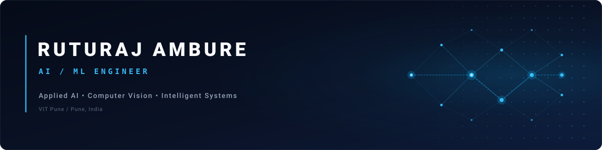

  

 

## Hi, I'm Ruturaj 👋

AI & Data Science undergraduate at VIT Pune focused on building practical AI/ML systems — from computer vision and predictive modeling to secure, production-ready applications.

  
  
  
  
  
  
  
  
  
  

---

### ── Featured Projects

> ### 🧬 [TumorVerse — AI-Powered Cancer Analysis](https://github.com/Ruturaj24062006)
> `Deep Learning` &bull; `Computer Vision` &bull; `U-Net` &bull; `PyTorch` &bull; `FastAPI`
> 
> Multimodal AI platform combining cancer prediction, medical-image analysis, tumor segmentation, and 3D tumor visualization.
> * **High-Precision Segmentation**: Implemented custom U-Net segmentation pipelines for digital pathology boundary detection and ResNet50 for tissue classification.
> * **Interactive Diagnostics**: Built FastAPI inference endpoints coupled with 3D visualization layers to reconstruct and render tumor volumes.

> ### 🔑 [KeyForge — API Key Management Platform](https://github.com/Ruturaj24062006)
> `Spring Boot` &bull; `PostgreSQL` &bull; `JWT` &bull; `React` &bull; `SSE`
> 
> Multi-tenant developer platform for secure API-key lifecycle management, auditing, authentication, and real-time usage monitoring.
> * **Robust Security Core**: Designed zero-trust authentication mechanisms with JSON Web Tokens (JWT) and role-based access control (RBAC).
> * **Real-Time Auditing**: Engineered event-streaming pipelines utilizing Server-Sent Events (SSE) to deliver instant key activity and usage updates.

> ### 🌡️ [Urban Heat Mitigation using AI/ML](https://github.com/Ruturaj24062006)
> `Machine Learning` &bull; `Remote Sensing` &bull; `Geospatial AI` &bull; `Python`
> 
> AI-driven research system for detecting urban heat hotspots and recommending optimized cooling interventions.
> * **Geospatial Processing**: Parsed remote sensing satellite datasets to trace land surface temperature anomalies and identify urban heat islands.
> * **Strategic Interventions**: Modeled heat vulnerability indexes and simulated optimization algorithms to recommend cooling corridors and tree cover placements.

---

### ── Engineering Experience

**Indian Railways (Nagpur Division)**  
*Project Developer (Sponsored)* | *April 2026 – June 2026*
* Engineered a centralized operational compliance and evaluation portal to trace inspector reports across regional railway stations.
* Designed automated reporting and PDF generation workflows, reducing compilation and audit cycles.
* Designed database indexing strategies and constraints to secure concurrent inspection logs.

**Cravita Technologies India Pvt. Ltd.**  
*Project Developer (Sponsored)* | *August 2025 – November 2025*
* Integrated LLM APIs to parse support ticket descriptions, automate incident classification, and generate response recommendations.
* Set up SMTP alerting hooks, accelerating ticketing dispatch times to support teams.
* Audited input serialization logic to guard endpoints against injection vulnerabilities.

---

### ── Research & Current Focus

I am actively exploring advanced architectures and methodologies in the following domains:

* 👁️ **Computer Vision & Deep Learning**: Semantic segmentation, medical-image computing, and object detection.
* 📊 **Applied Machine Learning**: Custom dataset pipeline optimization and predictive model training.
* 🗺️ **Geospatial AI**: Processing remote sensing datasets and spatial analysis with machine learning.
* 🧠 **Intelligent Decision Systems**: Structured rule evaluation, recommendation models, and audit frameworks.
* 🚀 **Production ML Systems**: High-concurrency APIs, system security, and endpoint latency reduction.

---

### ── Performance & Activity

<table border="0" cellpadding="0" cellspacing="0" width="100%">
  <tr>
    <td width="50%" align="center" valign="top">
      
    </td>
    <td width="50%" align="center" valign="top">
      
    </td>
  </tr>
</table>

---

  <h3>── Connect With Me ──</h3>
  &nbsp;
  &nbsp;
  
  
    
  &copy; 2026 Ruturaj Ambure &bull; Built for modern AI &amp; systems research.

